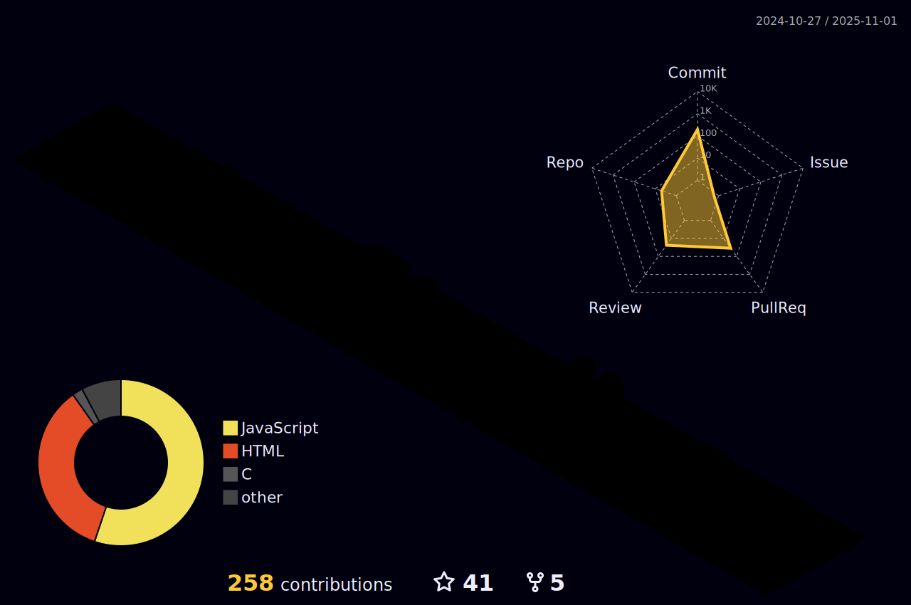

<h1 align="center">Hi 👋, I'm akash</h1>

## 🌍 About Me
- 🌱 I’m currently learning **React Three Fiber**
- 👯 I’m looking to collaborate on **Three.js projects**
- 💬 Ask me about **React, Three.js, or web development**
- ⚡ Fun fact: **I turn coffee into code ☕**

## 📱 Connect With Me

## ⚙️ Tools & Technologies

## 📖 Languages & Frameworks

## 🏆 GitHub Trophies

## 💻 My Coding Journey

 

## 📈 Activity & Contributions

## 🎾 Hobbies & Interests

## 👤 Contributors

  

---

### ❤️ Thanks for visiting my profile!

